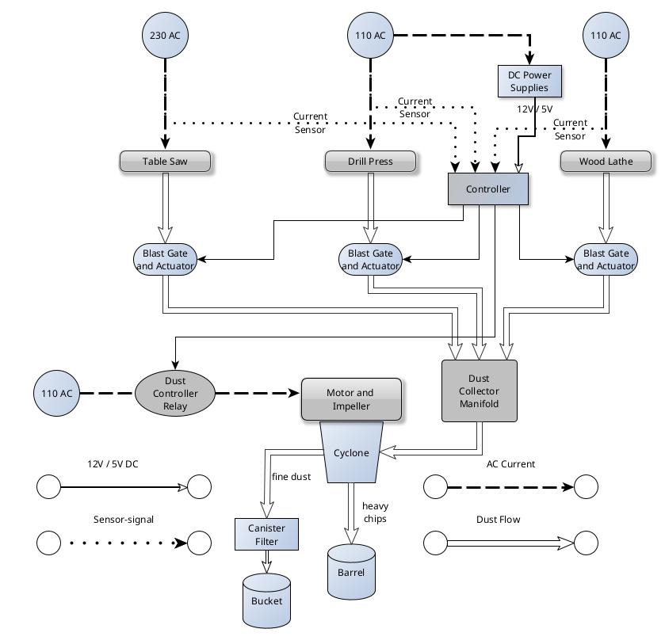
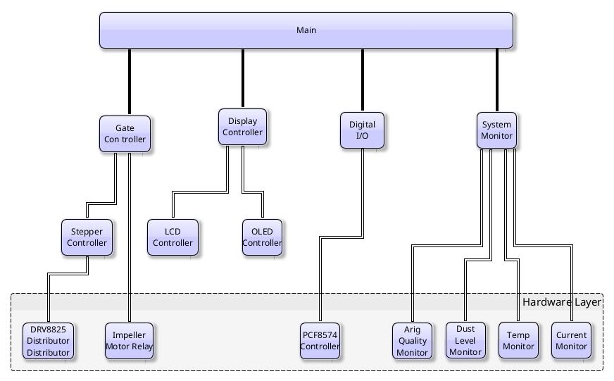
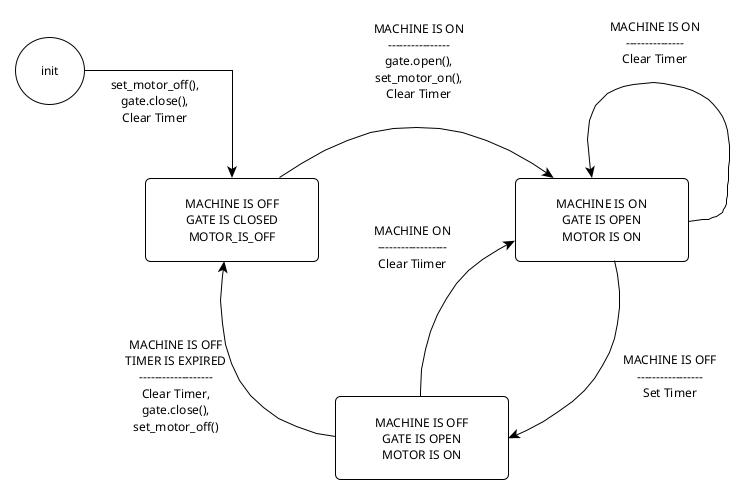

<!-- vscode-markdown-toc -->
* 1. [Overview](#Overview)
	* 1.1. [Essential  Goals](#EssentialGoals)
	* 1.2. [Optional  Goals](#OptionalGoals)
* 2. [The  Big  Picture  --  Physical  System](#TheBigPicture--PhysicalSystem)
	* 2.1. [The  Processor](#TheProcessor)
* 3. [Project  Directory  Structure](#ProjectDirectoryStructure)
* 4. [Software  Architecture](#SoftwareArchitecture)
* 5. [Key  Subsystems](#KeySubsystems)
	* 5.1. [The  Motor  Subsystem](#TheMotorSubsystem)
		* 5.1.1. [The  Distributor](#TheDistributor)
	* 5.2. [The  Digital  I/O  Subsystem](#TheDigitalIOSubsystem)
	* 5.3. [The  Current  Sense  Subsystem](#TheCurrentSenseSubsystem)
	* 5.4. [The  Gate  Control  Subsystem](#TheGateControlSubsystem)
* 6. [The  Top  Level  Software  Structure](#TheTopLevelSoftwareStructure)
* 7. [Enclosure](#Enclosure)
* 8. [The  Monitor  Subsystem](#TheMonitorSubsystem)
* 9. [Wiring](#Wiring)
	* 9.1. [The Current Sense Circuit](#TheCurrentSenseCircuit)
	* 9.2. [The  Distributor](#TheDistributor-1)
* 10. [Power  Supplies](#PowerSupplies)
	* 10.1. [Reboot,  Shutdown  and  Restart](#RebootShutdownandRestart)
* 11. [Digital  I/O  Pin  Map](#DigitalIOPinMap)
* 12. [Maintenance  Hints](#MaintenanceHints)
	* 12.1. [Stepper  Drivers](#StepperDrivers)
	* 12.2. [Power  Supplies](#PowerSupplies-1)
* 13. [Implementation Notes](#ImplementationNotes)
	* 13.1. [Scripting](#Scripting)
	* 13.2. [Coding](#Coding)
	* 13.3. [A Note on Using AI to Generate Code](#ANoteonUsingAItoGenerateCode)

<!-- vscode-markdown-toc-config
	numbering=true
	autoSave=true
	/vscode-markdown-toc-config -->
<!-- /vscode-markdown-toc -->

---
title:  DustCollector  Design  Document
author:  Paul  Silvis
mainfont:  DejaVu  Sans  Mono
monofont:  DejaVu  Sans  Mono
pdf-engine:  xelatex
---

##  1. Overview
This  project  grew  out  of  my  original  dust  collection  setup,  which  I  had  hacked  with  microswitches  and  a  solid-state  relay  so  that  when  I  opened  a  blast  gate,  the  dust  collector  would  come  on,  and  when  I  closed  the  gate  the  dust  collector  would  go  off.    Since  all  the  relays  were  'or-ed'  together,  it  would  stay  on  as  long  as  at  least  one  blast  gate  was  open.

This  was  easy  to  do,  and  reasonably  effective.    The  dust  collector  itself,  however,  was  not  effective.    I  had  an  inexpensive  1.5  HP  Delta  machine  with  heavy  felt  filter  bags.    These  clogged  up  quickly  with  fine  dust  from  the  lathe  and  heavier  dust  from  the  table  saw,  and  when  I  measure  it  I  was  only  getting  about  350  CFM.

As  the  years  went  on,  I  developed  _severe_  allergy  to  some  specific  types  of  wood  dust.    These  episodes  could  last  for  3  days  of  pure  misery.    I  faced  a  choice  --  either  give  up  woodworking  altogether  or  solve  this  dust  issue.

As  I  put  together  a  plan  for  salvaging  some  parts  of  the  original  collector  and  upgrading  my  filtering  capacity,  I  decided  that  it  would  be  really  _cool_  to  do  just  a  bit  more  automation,  and  have  the  blast  gates  operate  automatically  depending  on  what  tools  (e.g.,  tablesaw,  drillpress)  were  running.

This  would  prevent  me  from  being  lazy  and  just  using  the  tablesaw  for  a  minute  or  two  for  a  quick  cut  without  walking  the  3  steps  to  the  blast  gate.  ;-)    I  did  not  realize  at  the  time  how  much  saving 3  steps  would  cost  in  both  time  and  money.

###  1.1. Essential  Goals

So,  the  _essential_  goals  areh>:

-  Open  and  close  appropriate  blast  gates  automatically  when  any  powered  tool  is  running,  and  close  them  when  none  are  running.

-  Monitor  the  level  of  dust  in  the  main  collection  bin  and  flash  a  visible  warning  of  some  kind  if  it  should  be  emptied  soon.

-  Monitor  the  amount  of  fine  particulate  matter  in  the  air  and  turn  on  a  _Corsi-Rosenthal_  air  filter  that  will  run  until  the  air  has  been  'clean'  for  some  time.

-  Ensure  that  the  mechanism  for  opening  and  closing  blast  gates  is  timely  (on  the  order  of  2  seconds  or  so)  and  safe  from  jams  (i.e.,  has  timeouts  and  limit  switches).

-  The  entire  controller  must  fit  inside  a  wall-mounted  enclosure  with  a  clear  door  for  visibility.

###  1.2. Optional  Goals

-  Add  displays  to  show  internal  states,  opening  and  closing  of  gates,  collection  bin  dust  level,  air  pressure  in  ductwork,  etc.    Why  not  --  they're  cheap  and  they  don't  take  up  a  lot  of  resources
-  Monitor  temperature  inside  the  enclosure  and  be  prepared  to  shut  down  if  for  some  reason  things  get  too  hot.
-  Add  lots  of  digital  I/O  so  I  can  set  up  switches  for  my  grandchildren  to  push.    Some  of  these  may  create  spooky  outer-space  sounds,  or  activate  a  voice  message  or  flash  some  crazy  lights.    Anything  to  amuse  them  and  make  them  interested  in  what's  going  on  here.

##  2. The  Big  Picture  --  Physical  System
The  physical  system  consists  of:
-  the  recycled  impeller,  housing  and  motor  from  the  original  dust  collection  system.
-  a  'Dust  Deputy'  cyclone  to  direct  most  of  the  heavy  debris  downwards  to  ...
-  a  collection  bin  with  a  capacity  of  <tbc>  cubit  feet
-  a  heavy  duty  pleated  commercial  filter  rated  MERV  14  that  catches  particles  as  small  as  1.5  microns,  which  sits  atop...
-  a  removable  bucket  fastened  securely  to  it  that  holds  dust  released  from  cleaning  the  filter  by  banging  on  it  **gently**  while  dousing  it  with  **low-pressure**  compressed  air  from  the  outside.

The  operation  of  the  impeller  motor  is  controlled  by  a  solid-state  relay  whose  control  input  is  governed  by  the  DustCollector  controller.

The  [canister  filter](https://wynnenv.com/?s=13F230NANO+&post_type=product)  is  from  Wynn  Environmental,  and  costs  about  $230.  This  high-efficiency  filter  traps  over  95%  of  particles  sized  3.0-10.0  microns,  such  as  lint,  dust,  pollen,  pet  dander,  and  mold  spores,  as  well  as  particles  from  coughs,  sneezes,  and  smog.    Here's  a  [filter  rating  chart](https://www.mechreps.com/PDF/Merv_Rating_Chart.pdf)  to  give  you  more  information.

At  the  botom  of  the  filter  a  collection  bucket  is  attached  with  a  "gamma  seal"  lid  --  it  just  twists  off.

###  2.1. The  Processor
I  settled  on  a  Raspberry  Pi  4b  for  the  CPU,  with  8GB  of  ram  and  a  250G  solid  state  drive.    It  is  programmable  in  Python,  has  sufficient  GPIO  pins  for  my  needs,  support  for  I2C  and  very  fast  serial  communications.

It  also  has  direct  support  for  an  HDMI  monitor,  USB  keyboard  and  mouse,  and  sound  output.    Cool  --  I  can  do  a  lot  with  that.

##  3. Project  Directory  Structure

        ├──  docs
        │    └──  images
        ├──  hardware
        ├──  notebooks
        ├──  obsidian-vault
        ├──  src
        │    ├──  dustcollector
        │    └──  hardware
        └──  tests

-  The  'docs'  directory  holds  the  formal  documentation  (like  this  document).  
        -  Its  'images'  subdirectory  contains  any  images  generated  by  tools  such  as  GraphViz  (yEd),  WireVix,  or  Dot.

-  The  'hardware'  directory  holds  hardware  specific  code  such  as  drivers  for  specific  LCDs,  a/d  converters,  digital  I/O  expander  boards  and  so  on.

-  The  'notebooks'  directory  is  intended  for  [jupyter](https://jupyter.org/)  things  like  experiments,  informal  tests,  etc.

-  The  'obsidian-vault'  directory  holds  obsidian  docs  for  recording  design  decisions  along  the  way,  miscellaneous  notes  and  perhaps  some  maintenance  tips  (e.g.,  how  to  install  a  new  DRV8825  and  not  blow  things  up  by  forgetting  to  adjust  the  current.    You're  welcome.)

-  The  'src'  directory  holds  the  primary  source  files  (python,  config  files,  etc.).
        -  Its  'hardware'  subdirectory  holds  modules  that  are  dedicated  to  specific  low-level  devices  such  as  MCP23017  I2C  expanders,  PCF8574  digital  I/O  expanders  and  so  on.

##  4. Software  Architecture

##  5. Key  Subsystems

###  5.1. The  Motor  Subsystem
There  are  currently  4  motors  planned,  one  of  which  is  not  yet  implemented  and  is  being  saved  for  possible  use  by  the  router  (mounted  under  the  table-saw  wing)  or  as  an  auxiliary  port  for  the  small  vertical  belt  sander..

The  main  tools  are:
-  the  table  saw
-  the  lathe
-  the  drill  press

Each  of  these  has  a  5-inch  duct  connecting  it  to  the  intake  of  the  dust  collector.    At  some  point  on  the  ductwork  leading  to  each  tool  there  is  a  blast  gate  that  controls  the  flow  of  air  into  the  dust  collector.

Each  blast  gate  has  a  stepper  motor  mounted  on  it  to  move  the  gate  opened  and  closed.    Momentary-contact  limit  micro-switches  are  mounted  at  each  end  of  travel  to  tell  the  controller  that  the  blast  gate  has  reached  the  desired  position.    [Note  --  a  timeout  will  occur  if  this  hasn't  happened  in  a  reasonable  amount  of  time,  and  a  warning  of  some  sort  will  be  issued.

The  [stepper  motors](https://www.amazon.com/dp/B00PNEQKC0?ref_=ppx_hzsearch_conn_dt_b_fed_asin_title_3)  are  Nema  17  Bipolar,  2A,  59Ncm.    These  are  more  than  powerful  enough  to  overcome  any  friction  in  the  blast-gate  slide  mechanism.

####  5.1.1. The  Distributor

The  requirement  to  run  the  steppers  fast  enough  to  satisfy  a  2-second  open/close  time  was  difficult  to  handle  with  plain  old  I2C  expanders  like  the  MCP23017  --  the  bus  was  just  too  slow.    I  opted  for  creating  a  new  sub-sub-system  called  the  'distributor'  which  uses  a  pair  of  8-bit  shift  registers  and  the  SPI  bus  to  squirt  out  enable/step/dir  signals  to  4  motors  quite  rapidly.    There  is  a  detailed  breakdown  in  the  [Wiring](#wiring)  section  to  show  how  this  is  mapped  to  individual  motors.

###  5.2. The  Digital  I/O  Subsystem
The  digital  I/O  is  almost  entirely  managed  by  a  set  of  PCF8574  I2C-based  8-bit  expander  boards.    5  of  them  ganged  together  gives  40  I/O  bits,  which  are  periodically  read  into  a  40-bit  buffer.    See  the  section  on  Digital  I/O  Pin  Map  for  details.

[Yes,  this  is  excessive.    I  don't  care.    I  like  lots  of  switches  and  buttons.]

###  5.3. The  Current  Sense  Subsystem
The  'on'  or  'off'  state  of  a  given  power  tool  such  as  the  table  saw  is  determined  by  detecting  the  presence  or  absence  of  current  in  a  split-coil  transformer  wrapped  around  the  'hot'  line  going  to  the  saw.    This  is  connected  to  a  custom  circuit  on  the  controller  that  converts  the  0  -  100  mA  current  into  a  0-5V  signal  to  be  read  by  an  a/d  converter  and  converted  to  a  logic  value  meaning  'on'  or  'off'.

###  5.4. The  Gate  Control  Subsystem
The  gate  conrol  system  is  responsible  for  sensing  machine  state  (On  or  Off),  opening/closing  the  appropriate  blast  gate[s]  and  turning  on  (or  off)  the  dust  collector  impeller  motor.

There  is  currently  a  provision  for  a  delay  before  turning  off  all  tools  and  turning  off  the  dust  collector  impeller  motor.    This  is  to  allow  any  remaining  dust  to  be  sucked  out  of  the  system.    It  may  turn  out  that  this  is  unnecessary  due  to  the  high  velocity  of  the  air  in  the  ducts  (estimated  to  be  over  80  MPH).

##  6. The  Top  Level  Software  Structure

Although  this  is  not  a  'hard  real-time'  problem,  there  are  many  things  to  keep  track  of  in  a  timely  manner.    'Bob'[^Bob]  suggested  using  Python's  asyncio  package  to  help  with  this,  and  I  agree  wholeheartedly.    This  enables  the  top-level  structure  of  the  program  to  be  divided  cleanly  into  separate  tasks  that  will  not  step  on  each  other.

[^Bob]:  This  is  the  name  I  gave  to  my  ChatGPT  agent.   We're  good  friends  now.]

##  7. Enclosure

The  [enclosure](https://www.amazon.com/dp/B0D4M7V61Q?ref_=ppx_hzsearch_conn_dt_b_fed_asin_title_5&th=1)  is  an  "ABS  Electrical  Junction  Box,  Ventilated  Design,  with  Cable  Grommets,  IP65  Waterproof  Enclosure,  Indoor/Outdoor  Use  with  Mounting  Panel..  (Clear  Cover,  17.7"x13.7"x7.9")  "  from  Amazon.

Connections  to  the  outside  world  are  run  via  pass-through  connectors,  so  the  entire  enclosure  can  be  easily  removed  from  its  wall-based  mounting  panel  for  benchwork.

##  8. The  Monitor  Subsystem

This  subsystem  is  a  catch-all  for  anything  I  can  think  of  to  measure  the  system  to  provide  useful  information.

Some  candidates  are:
-  temperature  at  various  places  in  the  enclosure  (e.g.,  the  Pi  computer  chip,  the  motor  driver  heat-sinks,  etc.)
-  current  draw  for  3.3V,  5V  and  12V  busses.
-  level  of  dust  in  the  collection  bin
-  failure  to  open  or  close  a  blast-gate  in  time

It  is  likely  that  some  temperature  information  may  be  used  to  turn  on  PC  fans  to  vent  the  enclosure  more  thoroughly.

##  9. Wiring

Yes,  there  are  lots  of  wires  here.    Many  of  the  cables  are  custom-made  for  these  reasons:

1.  Length  considerations
2.  Connector  type  mismatches
3.  Connector  pin  assignments  don't  match.

For  example,  some  I2C  boards  have  signals  in  the  order  [vdd,  gnd,  scl,  sda],  while  others  switch  vdd  and  ground,  and  scl  and  sda.    These  cables  are  labeled  and  clearly  marked  as  CUSTOM,  and  usually  have  a  bit  of  whiteout  to  help  show  what  goes  to  what.

I  tried  to  maintain  a  consisten  color  coding  scheme  for  wiring,  but  did  not  succeed  completely.    In  general,  however,  for  power  wiring,  I  have  followed  this  scheme:

A/C:
        Neutral  --  White  (referred  to  as  Gnd  on  the  board)
        Hot  --  Black
        Ground  --  Green.

D/C:
        5V  --  Orange
        3.3V  --  Black
        12V  --  Red
        Gnd  --  White

All  Ground  connections  are  tied  together  on  the  board.

____Remember  --  this  is  not  guaranteed!      Look  at  where  the  wires  go  to  be  sure.____

###  9.1. The Current Sense Circuit

This custom circuit board holds 4 identical circuits to convert a 0-100 mA current from a transformer into a small voltage that a 4-channel ADS1115 a/d converter can read.

<TBD> Need a circuit diagram here.

###  9.2. The  Distributor
This  custom  circuit  board  is  mounted  with  the  4  stepper  driver  boards.    It  consists  of  two  74HC595  8-bit  shift  registers  fed  by  the  fast  SPI  interface.

<TBD> Need a circuit diagram here.

This  is  explained  in  great  detail  here  since  it  took  me  a  while  to  figure  it  all  out  and  get  it  straight.

#####  74HC595  Chaining  and  Bit-to-Pin  Mapping

You  have  chip1  and  chip2.    As  you  look  at  the  board,  chip1  is  on  the  left.  **Note  carefully  that  the  chip  on  the  right  (chip2)  is  upside  down,  with  pin  1  at  the  bottom  right.**]  Here  is  a  detailed  breakdown  to  show  how  this  is  mapped  to  individual  motors.

Each  74HC595  has  8  outputs:  Q0–Q7  (pins  15,  1,  2,  3,  4,  5,  6,  7).
You  are  using  pins  1-6  (Q1–Q6)  on  each  chip  for  step/dir/enb.
You’re  sending  2  bytes  over  SPI:  byte1,  byte2.

#####  Critical  Fact  About  Chained  595s:

The  first  bits  shifted  out  land  furthest  down  the  chain.
The  last  bits  shifted  out  stay  closest  to  the  Pi.

Thus:
-  byte1  →  chip2
-  byte2  →  chip1

Bit-to-Pin  Layout  (directly  from  the  code)

        Bit  layout  is  based  on  physical  pin  mapping:
        -  High  byte  (bits  15–8)  →  Chip2  (rotated  180°)
        -  Low  byte  (bits  7–0)      →  Chip1  (upright)
        -  Data  sent  MSB  first  (bit  15  down  to  bit  0)

        MOTOR_MAP  =  {
                1:  {'en':  12, 'step':   13,  'dir':  14},
                2:  {'en':  9,  'step':   10,  'dir':  11},
                3:  {'en':  4,  'step':    5,  'dir':  6},
                4:  {'en':  1,  'step':    2,  'dir':  3},
        }

In  Practical  Summary:
---------------------
-  byte1  →  fills  chip2  (the  far  one)
-  byte2  →  fills  chip1  (the  near  one)
-  Pins  1-6  on  each  chip  will  reflect  bits  1-6  of  each  respective  byte.
-  MSB  (bit  7)  and  LSB  (bit  0)  could  be  unused  or  reserved.

Visual  Sketch:
--------------
SPI  -->  [byte2][byte1]
                  |            |
                  |            +-->  chip2  (pins  1-6)
                  +-------->  chip1  (pins  1-6)

Practical  Tip  for  Code:
-----------------------
When  sending:
        spi.xfer2([byte2,  byte1])    #  byte2  first  for  chip1,  byte1  second  for  chip2

If  you're  building  bytes  on  the  fly:
        byte2  =  (enb4  <<  1)  |  (dir4  <<  2)  |  (step4  <<  3)  |  (enb3  <<  4)  |  (dir3  <<  5)  |  (step3  <<  6)
        byte1  =  (enb2  <<  1)  |  (dir2  <<  2)  |  (step2  <<  3)  |  (enb1  <<  4)  |  (dir1  <<  5)  |  (step1  <<  6)

**Final  Word:**

Pin  9  (QH*)  serial  out  is  ONLY  used  between  chips.  After  two  chips,  if  you  don't  add  more,  you  can  ignore  it.

----------------------------------------

#####    The  Net  Result

This  organization  means  that  it  is  easy  to  spot  the  3  signals  need  for  each  motor.    Take  a  look  at  the  circuit  board  and  you'll  s        """ee  that  E(enable),  S(step)  and  D(dir)  are  grouped  for  each  motor.    Look  at  the  two  shift-register  chips.  For  chip  1  (left)  pins  1,  2  and  3  are  ESD  for  motor  4  (the  nearest  motor.  For  chip  2  (right)  pins  4,  5  and  6  are  ESD  for  Motor  1  (the  nearest  motor).    You  get  the  idea.  Cool.

##  10. Power  Supplies

I  decided  not  to  use  the  Raspberry  Pi  4b  plug-in  power  input  for  these  reasons:

1.    I  didn't  know  at  the  beginning  how  much  current  I  might  need
2.    I  needed  an  external  12-volt  supply  anyway.

Both  supplies  were  furnished  by  Amazon:
-  [5V  supply]  (https://www.amazon.com/dp/B07PPPF1R5?ref_=ppx_hzsearch_conn_dt_b_fed_asin_title_5&th=1)  

          Description:  5V  5A  Power  Supply,25W  Universal  Regulated  Switching  Power  Converter  Adapter  Transformer  for  LED  Strip  Light,Probe  Signal  Lamp,CCTV,  Radio,  Computer  Project  

-  [12V  supply]  (https://www.amazon.com/dp/B00M8TBJLK?ref_=ppx_hzsearch_conn_dt_b_fed_asin_title_6)  

        Description:  LRS-150-12  150W  12V  12.5  Amp  Enclosed  Switchable  Power  Supply  

These  power  supplies  are  mounted  on  a  separate  board  that  is  detachable  from  the  main  mounting  board.    They  are  fed  from  a  common  A/C  source  via  GX  connectors,  and  routed  into  the  enclosure  with  replaceable  fuses  in-line.

###  10.1. Reboot,  Shutdown  and  Restart
Both  power  supplies  run  through  an  emergency  shutoff  switch  with  a  plastic  cover.    You  probably  should  not  lock  the  plastic  cover  --  it's  just  there  to  prevent  you  from  using  it  as  an  ordinary  shutdown.    When  the  button  is  pressed,  it  shuts  off  all  power  to  the  controller,  and  this  also  cut  power  to  the  relay  that  controls  the  impeller  motor.

The  preferred  way  of  shutting  down  the  system  is  to  press  the  little  button  below  the  emergency  shutoff  labeled  "reboot  /  shutdown".    If  you  press  for  1  second  or  less,  it  will  reboot.    If  you  hold  it  for  more  than  2  seconds,  it  will  just  shutdown  the  Raspberry  Pi.    In  **neither**  case  will  it  shut  off  the  power  supplies.    To  restart  the  system,  push  the  big  red  button,  then  release  it  by  twisting  clockwise.

##  11. Digital  I/O  Pin  Map

Digital  I/O  is  handled  via  a  40-bit  map  in  software.    A  single  board  contains  5  instances  of  PCF8574  8-bit  digital  I/O  expanders  connected  to  the  I2C  bus.  

The  map  currently  looks  like  this  (not  all  bits  are  assigned  yet  --  this  mapping  shows  the  assigments  for  connectors  J1  and  J2):

|        |  Connector        |      Pin  #  |      Bit#  (0-39)  |        |  Manual  Function        |  Auto  Function      |
|----|--------------|---------|---------------|--------------|--------------------|-----------------|
|    0  |  DB-25  J1          |          |                      |                    |                                |                          |
|    1  |                    |              1  |                        32  |                    |  Motor  1  ON                  |  Same                        |
|    2  |                    |              3  |                        33  |                    |  Gate  1  OpenLImit      |  Same                        |
|    3  |                    |              5  |                        34  |                    |  Gate  1  ClosedLimit  |  Same                        |
|    4  |                    |              7  |                        35  |                    |  Motor  2  ON                  |  Same                        |
|    5  |                    |              9  |                        36  |                    |  Gate  2  OpenLImit      |  Same                        |
|    6  |                    |            11  |                        37  |                    |  Gate  2  ClosedLimit  |  Same                        |
|    7  |                    |            14  |                        38  |                    |  Motor  3  ON                  |  Same                        |
|    8  |                    |            16  |                        39  |                    |  Gate  3  OpenLImit      |  Same                        |
|    9  |                    |            18  |                        24  |                    |  Gate  3  ClosedLimit  |  Same                        |
|  10  |                    |            20  |                        25  |                    |  Motor  4  ON                  |  Same                        |
|  11  |                    |            22  |                        26  |                    |  Gate  4  OpenLImit      |  Same                        |
|  12  |                    |            24  |                        27  |                    |  Gate  4  ClosedLimit  |  Same                        |
|  13  |                    |          |                      |                    |                                |                          |
|  14  |  DB-25  J2          |              1  |                        28  |                    |                                |                          |
|  15  |                    |              3  |                        29  |                    |                                |                          |
|  16  |                    |              5  |                        30  |                    |                                |                          |
|  17  |                    |              7  |                        31  |                    |                                |                          |
|  18  |                    |              9  |                        16  |                    |                                |                          |
|  19  |                    |            11  |                        17  |                    |                                |                          |
|  20  |                    |            14  |                        18  |                    |                                |                          |
|  21  |                    |            16  |                        19  |                    |                                |                          |
|  22  |                    |            18  |                        20  |                    |                                |                          |
|  23  |                    |            20  |                        21  |                    |                                |                          |
|  24  |                    |            22  |                        22  |                    |                                |                          |
|  25  |                    |            24  |                        23  |                    |                                |                          |

##  12. Maintenance  Hints
This  section  contains  advice  to  my  future  self  for  likely  maintenance  /  upgrade  /  repair  events.

###  12.1. Stepper  Drivers

There  are  4  stepper  motor  DRV8825  driver  boards  mounted  on  an  acrylic  plate,  labeled  1,  2,  3  and  4.    In  the  center  of  those  is  a  custom-made  circuit  board  called  'The  Distributor'  which  uses  the  SPI  bus  to  squirt  control  bits  very  rapidly.

The  DRV8825  chips  are  mounted  on  [Jeanoko  DRV8825/A4988  Stable  42  Stepper  Motor  Driver  Expansion  Boards](https://www.amazon.com/dp/B0C4P8997M?ref_=ppx_hzsearch_conn_  is  to  press  the  little  button  below  the  emergency  shutoff  labeled  "reboot  /  shutdown".    If  you  press  for  1  second  or  less,  it  will  reboot.    If  you  hold  it  for  more  than  2  seconds,  it  will  just  shutdown  the  Raspberry  Pi,    In  _neither_  case  will  it  shut  off  the  power  supplies.    To  restart  the  system,  push  the  big  red  button,  then  release  it  by  twisting  clockwise.dt_b_fed_asin_title_1).    Each  board  has  a  very  tiny  potentiometer  for  adjusting  the  current  limit.    You  ____must____  adjust  these  if  you  replace  them  or  you  run  the  risk  of  frying  something  important.    

**Safe  VREF  Setup  Without  Motor  Connected  (Courtesy  of  Bob)**

**Purpose:**

        Prevents  the  chance  of  slamming  full  current  into  the  motor  during  first  power-up.

        Avoids  a  damaged  motor,  a  fried  driver,  or  accidental  runaway  heating.
        
**Steps:**

        Install  the  new  DRV8825  board,  BUT  DO  NOT  connect  the  motor  coils  yet.

                Leave  the  motor  wiring  unplugged.

                Only  connect  logic  (VDD,  GND,  STEP,  DIR,  ENABLE)  and  motor  power  (VMOT,  GND).

        Power  up  the  system  (logic  and  VMOT  live).

        Measure  VREF  at  the  trimpot  just  like  before:

                Black  multimeter  probe  to  GND.

                Red  probe  to  the  metal  top  of  the  potentiometer.

        Adjust  VREF  carefully:

                Clockwise  to  increase,  counterclockwise  to  decrease.

                Set  VREF  based  on  the  formula:
                VREF=0.5×Desired  Motor  Current  (A)
                VREF​=0.5×Desired  Motor  Current  (A)

        Confirm  the  VREF  is  in  the  right  ballpark  (e.g.,  0.60V  for  1.2A  motor  current).

        Power  down  the  system.

        Connect  the  motor  coils  properly:

                Double-check  you  know  which  motor  wire  pairs  are  each  coil.

                (If  not  sure,  I  can  give  you  a  10-second  multimeter  method.)

        Power  back  up  and  test  the  motor  gently  (slow  step  pulses  first).

I  recommend  that  you  use  a  very,  very  tiny  phillips  screwdriver  to  do  the  adjustment.    If  you  use  one  that  is  too  large,  it  will  not  engage  but  will  _look_  like  its  engaged,  and  nothing  will  happen  (how  do  I  know  this?).    The  potentiometer  is  very  sensitive,  so  make  tiny  adjustments  as  you  get  close.

###  12.2. Power  Supplies

If  you  have  to  replace  a  power  supply,  try  to  get  an  identical  replacement.    Be  sure  to  adjust  the  voltage  output  before  connecting  it.

##  13. Implementation Notes
###  13.1. Scripting
There are some details about startup that bear mentioning here.

<TBD> MENTION THEM!

###  13.2. Coding

The coding is all in Python.  The code is mostly (but not entirely) generated by Bob according to my prompts and editing suggestions.

This is not a professional project, soI have not bothered to create pydoc-style comments for everything.  It's just for me and whoever the hell happens to be reading this.

The style guide is:

- pycodestyle compliant
- flake8 compliant
- black -l 79 compliant

There are minor exceptions for a few cases where it just doesn't make sense to go to great lengths to wrap things.

###  13.3. A Note on Using AI to Generate Code

An LLM like Bob (aka ChatGPT) does a remarkably good job of generating code.  Most of the time.  What I've learned is that once you've given a spec in a prompt and then had him edit the code repeatedly to make small name changes, add or modify features and so on, he gets confused.

The reason for the confusion is that he's editing the code based on _pattern matching_, so he sometimes does not take into account the larger context of the entire program.

In such cases, when we started to flounder through repeated edits that were not getting any closer to correct, it was useful to have the original spec, update it to reflect the new/modified requirements, and have Bob generate the code explicitly from scratch.